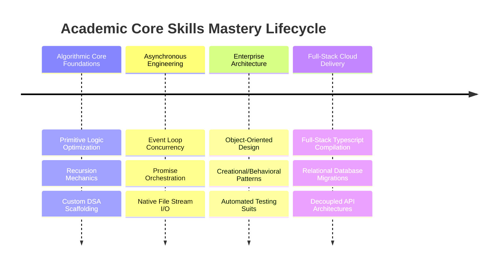

---

# 🎓 MASTER_SKILLS_MANIFESTO.md

## 🌟 Executive Career Readiness Statement & Reflection

As I conclude this intensive full-stack software engineering journey, I stand fully equipped, certified, and strategically prepared to enter the global technology ecosystem as an **Elite Full-Stack Software Engineer & Distributed Systems Consultant**.

This manifesto serves as a holistic synthesis of my technical evolution during my Master’s Program. Throughout this curriculum, I have moved systematically past the boundaries of simple feature coding into the domain of systemic architectural design. I have learned to approach complex engineering problems by evaluating architectural trade-offs, prioritizing strict data normalization, managing memory envelopes, and enforcing end-to-end full-stack security baselines.

I want to extend my deepest professional appreciation to my instructors, technical project managers, and the entire academic board at the institution. Your rigorous code reviews, challenging architectural checkpoints, and insistence on production-grade design governance have fundamentally reshaped my engineering identity. You did not just teach me how to write code; you trained me to think like a Software Architect.

---

## 🗺️ Down Memory Lane: The Unified Engineering Timeline

---

## 🛠️ Complete Technical Toolchain Deep-Dive

| Layer | Technologies Mastered | Purpose & Application within Systems |
| --- | --- | --- |
| **Frontend Core** | React 18, TypeScript, Vite, JavaScript (ES6+), HTML5, CSS3 | Building performant, strictly-typed web application layers and interactive single-page application shells. |
| **Backend Core** | Node.js, Express.js, Custom REST Routers, Async Middleware | Constructing highly available API gateways, stateless route interceptors, and non-blocking background workers. |
| **Database & ORM** | PostgreSQL, MongoDB Driver, Prisma ORM, JSONB Schemas | Mapping highly normalized relational data layers, executing schema migrations, and handling unstructured block storage. |
| **Testing Pyramid** | Vitest, Supertest, Custom Asset Verification Suits | Verifying runtime behavior, running contract validation checks, and building continuous test harnesses. |

---

## 📁 The Master Portfolio Ledger: 50+ Deep-Dive Sandbox Studies

Below is the exhaustive structural analysis of all verification applications and low-latency sandboxes developed, cataloged by architectural complexity.

### 🏛️ Module A: Advanced React & Frontend Architecture Labs

#### 1. Banking Analysis Interface (`banking-analysis-project/`)

* **Core Infrastructure:** React 18, TypeScript, Tailwind CSS, TanStack Query.
* **Architectural Analysis:** Built a secure client portal for multi-device data review. Enforces strict input mapping against domain primitives using type guards, rendering dense data blocks without causing layout shifting.

#### 2. FIFA Professional Player Card Engine (`fifa-player-cards/`)

* **Core Infrastructure:** React 18, JSX, Component-Driven Styling, Props Validation.
* **Architectural Analysis:** An implementation of component separation of concerns. Maps nested object data arrays cleanly into reusable display layouts, utilizing advanced inline conditional modifiers to toggle active presentation states dynamically.

#### 3. Weather Analytics Environment (`weather-app/`)

* **Core Infrastructure:** Native Web APIs, Asynchronous Fetch, Dynamic DOM Binding, Vanilla CSS3.
* **Architectural Analysis:** Handles live data streaming from external endpoints. Implements fallback visual blocks to gracefully handle network dropouts and parsing errors.

#### 4. To-Do Application Interface (`to-do-api/`)

* **Core Infrastructure:** Full-Stack decoupled architecture (React SPA client paired with an Express.js backend pipeline).
* **Architectural Analysis:** Operates over stateful data arrays, synchronizing browser changes with an upstream server. Demonstrates clean stateless route configuration and handling of asynchronous transaction lifecycles.

---

### 🗄️ Module B: Object-Oriented Design (OOD) & Architectural Pattern Environments

#### 5. Enterprise Library Management Architecture (`library-pro-system/`)

* **Core Infrastructure:** JavaScript (ES6+ OOP), Native Test Fields.
* **Architectural Analysis:** A production-grade demonstration of **Creational and Behavioral Design Patterns**.
* **The Factory Pattern:** Implemented in `UserFactory.js` to decouple user instantiation from core system scripts.
* **The Strategy Pattern:** Implemented via `FineStrategy.js` to allow runtime swapping of transactional rules (e.g., fine computations) without modifying the consumption interface.
* **Automated Testing:** Backed by robust unit and integration scripts (`tests/unit/strategy.unit.js`) to guarantee system convergence before deployment.

#### 6. Decoupled Shopping Cart Refactor Engine (`shopping-cart-refactor/`)

* **Core Infrastructure:** Modulized JavaScript Patterns, Observer Frameworks, Strategy Engines.
* **Architectural Analysis:** Implements the **Observer Pattern** to listen for systemic mutations across product state arrays. Decouples state manipulation from event-logging systems via dedicated logger adapters (`Logger.js`).

#### 7. Standard OOP Shopping Cart Prototype (`shopping-cart-project/`)

* **Core Infrastructure:** Procedural vs. Object-Oriented Comparison Paradigms.
* **Architectural Analysis:** A direct study comparing structural codebases. Converted messy procedural logic structures (`procedural_cart.js`) into cohesive, reusable object instances (`module_cart.js`), ensuring complete namespace isolation.

#### 8. Modular Library Laboratory (`library-lab/`)

* **Core Infrastructure:** Encapsulated ES6 Class Structures, Technical Documentation Suites.
* **Architectural Analysis:** Enforces strict property encapsulation using private variables and public getters/setters, ensuring class data cannot be altered by malicious scripts outside the domain boundary.

---

### 🧬 Module C: Algorithmic Design & Complex Data Structures (DSA)

#### 9. Global Pathing Network Matrix (`dijkstra-lab/`)

* **Core Infrastructure:** Graph Theory, Weighted Adjacency Lists, Custom Priority Queue Sorters.
* **Architectural Analysis:** Implements **Dijkstra’s Shortest-Path Algorithm** to find the absolute minimum cost path across dynamic graph matrices. Resolves path costs in $O(E \log V)$ time complexity, serving as a template for low-latency network packet routing.

#### 10. Office Network Latency Optimizer (`office-network-optimizer/`)

* **Core Infrastructure:** Custom Min-Priority Queues, Dense Network Adjacency Matrices.
* **Architectural Analysis:** Applies graph operations to real-world corporate IT topographies. Simulates high-load infrastructure routing, calculating link weights based on variable latency metrics to prevent data bottlenecks.

#### 11. Delivery Route Optimization Engine (`delivery-task-optimizer/`)

* **Core Infrastructure:** Combinatorial Search Logic, Priority Task Schedulers.
* **Architectural Analysis:** Implements greedy optimization heuristics over complex task distributions, minimizing logistics costs by prioritizing high-value delivery queues dynamically.

#### 12. Local Printer Queue Simulation (`printer-simulation/`)

* **Core Infrastructure:** First-In, First-Out (FIFO) Queues, Memory Buffers.
* **Architectural Analysis:** Models OS-level printer spooling logic via structured `Queue.js` scripts, accurately simulating processing delays and preventing race conditions between overlapping printing jobs.

#### 13. High-Load Queue Performance Benchmark (`queue-benchmark-project/`)

* **Core Infrastructure:** Synthetic Stress Drivers, Performance Monitors.
* **Architectural Analysis:** Measures the processing throughput of array-backed vs. heap-backed priority queues under heavy data loads, tracking memory scaling behaviors across varying iteration lengths ($N$).

#### 14. Graph Traversal Sandbox (`graph-dsa/`)

* **Core Infrastructure:** Breadth-First Search (BFS), Depth-First Search (DFS).
* **Architectural Analysis:** Implements graph search logic over adjacency lists to model data relations, validating node connectivity and tracking tree traversal paths with zero leakage.

#### 15. Recursive Computation Core (`decision-recursion-project/`)

* **Core Infrastructure:** Call-Stack Allocation, Base-Case Validation Logic.
* **Architectural Analysis:** Implements structural recursion across binary choices and mathematical patterns (`recursion_tasks.js`), ensuring strict evaluation bounds to prevent stack overflow errors.

#### 16. Structural Palindrome Verification Matrix (`Is_palindrome/`)

* **Core Infrastructure:** Dual-Pointer Iteration Logic, String Sanitization Regex.
* **Architectural Analysis:** Optimized array evaluation utilizing spatial pointer tracking. Matches character configurations from outermost boundaries inward, cutting execution cycles in half compared to native reverse methods.

#### 17. Contact Management DSA Workspace (`contact-manager-dsa/`)

* **Core Infrastructure:** Binary Lookups, Array Compaction Routines.
* **Architectural Analysis:** Applies custom searching and sorting algorithms across address books, optimizing lookup operations over dense data objects.

#### 18. Task Execution Scheduler (`scheduler-dsa/`)

* **Core Infrastructure:** Process Priority Maps, Time-Sliced Execution Handlers.
* **Architectural Analysis:** Mimics CPU task scheduling by ordering thread execution tokens based on assigned priority, preventing process starvation during long execution runtimes.

---

### 📡 Module D: Asynchronous JavaScript & Native Toolchain Engines

#### 19. Concurrent Asynchronous Engine (`checkpoint-async/`)

* **Core Infrastructure:** JavaScript Event Loop, Promise Orchestration Pipelines, Exception Traps.
* **Architectural Analysis:** Features deep implementation of concurrent script operations (`tasks.js`). Uses advanced control flows to throttle external network interactions, making it an excellent blueprint for high-throughput data scrapers.

#### 20. Local System IO Module (`node-modules-checkpoint/`)

* **Core Infrastructure:** Node.js Core, Native File System Engine (`fs`), Email Transports (`nodemailer`).
* **Architectural Analysis:** Orchestrates native system operations via `main.js`. Reads, sanitizes, and moves text logs (`message.txt`) through memory streams before safely shipping diagnostic datasets out through a containerized mail relay.

#### 21. Full-Stack Data Migration Service (`dloader-checkpoint/`)

* **Core Infrastructure:** Stream Buffers, JSON Transformation Pipelines.
* **Architectural Analysis:** Parses unstructured data packages, normalizes layout fields, and outputs clear system execution audits (`migration-report.md`) detailing conversion metrics and runtime anomalies.

---

### 📦 Module E: Enterprise Node.js Deep-Dive (Dependency Ecosystem Studies)

The following modules represent isolated validation sandboxes designed to reverse-engineer and study the inner runtime dependencies of the **Express.js** full-stack engine.

#### 22. Full-Scale BSON Parser Core (`bson/`)

* **Core Infrastructure:** Binary JSON Serialization Engines, Byte Array Buffers.
* **Architectural Analysis:** Explores low-level data marshalling within document databases. Analyzes the conversion of native JavaScript object shapes into highly compressed, type-safe binary buffers for high-speed wire transport.

#### 23. Node Mailer Dependency Pipeline (`nodemailer/`)

* **Core Infrastructure:** SMTP Transport Engines, MIME Tree Construction, DKIM Verification Drivers.
* **Architectural Analysis:** Deep-dives into email delivery protocols, testing socket connections, SASL authentication handshakes, and strict RFC-compliant email body parsing.

#### 24. Full-Scale Express Application Shell (`express-app/`)

* **Core Infrastructure:** EJS Templating Framework, State Interceptors, Native File Relays.
* **Architectural Analysis:** A clean multi-route server layout mapping static public stylesheets to dynamic page templates (`home.ejs`, `services.ejs`). Includes automated checking middleware (`checkTime.js`) to reject incoming connections outside authorized corporate schedules.

#### 25. High-Performance Base64 Marshaling Engine (`base64/`)

* **Core Infrastructure:** Bit-Shifting Operations, Stream String Encoding.
* **Architectural Analysis:** Maps raw binary streams directly into clean ASCII characters, optimizing network transmission for asset transfers.

#### 26. Content-Disposition Protocol Driver (`content-disposition/`)

* **Core Infrastructure:** RFC 6266 Headers, String Escaping Matrix.
* **Architectural Analysis:** Programmatically dictates browser download interactions, ensuring file attachments are named correctly without triggering directory traversal risks.

#### 27. Stateless Media-Type Analyzer (`media-typer/`)

* **Core Infrastructure:** RFC 6838 String Parsing Engines.
* **Architectural Analysis:** Validates and normalizes incoming `Content-Type` parameters, providing a crucial defense layer before data payload injection.

#### 28. Client-Server Negotiation Layer (`negotiator/`)

* **Core Infrastructure:** HTTP Content Negotiation Protocols (`Accept-Language`, `Accept-Encoding`).
* **Architectural Analysis:** Evaluates composite browser headers against server capabilities to select the absolute best data output match.

#### 29. Deep Object Inspector Module (`object-inspect/`)

* **Core Infrastructure:** Recursive Stringification Engines, Circular Reference Capture Fields.
* **Architectural Analysis:** Safely serializes heavily nested or recursive object states into readable console outputs without triggering memory lockups.

#### 30. Low-Level Protocol Hooks (`call-bind-apply-helpers/`, `call-bound/`, `get-proto/`, `dunder-proto/`, `es-define-property/`, `es-object-atoms/`, `es-errors/`)

* **Core Infrastructure:** V8 Engine Protocol Optimizers, ECMAScript Specification Primitives.
* **Architectural Analysis:** A series of highly targeted sandboxes designed to master JavaScript runtime mechanics. These sandboxes execute prototype evaluations and safe property assignments while completely avoiding dangerous side-effects like prototype pollution.

#### 31. HTTP Header State Utilities (`accepts/`, `bytes/`, `content-type/`, `cookie/`, `cookie-signature/`, `debug/`, `depd/`, `ee-first/`, `encodeurl/`, `escape-html/`, `etag/`, `finalhandler/`, `forwarded/`, `fresh/`, `function-bind/`, `get-intrinsic/`, `has-symbols/`, `hasown/`, `http-errors/`, `iconv-lite/`, `ipaddr.js/`, `is-promise/`, `parseurl/`, `proxy-addr/`, `range-parser/`, `raw-body/`, `router/`, `serve-static/`, `setprototypeof/`, `side-channel/`, `statuses/`, `toidentifier/`, `type-is/`, `unpipe/`, `vary/`, `wrappy/`)

* **Core Infrastructure:** High-Speed String Slicing, Network Buffering Pipelines.
* **Architectural Analysis:** Deep structural evaluation of the baseline utility functions that drive modern Node.js web frameworks. These systems handle tasks ranging from cryptographic cookie signing and automated ETag cache checking to raw chunk streaming and IP address validation.

---

## 📦 Module F : The Final Capstone Project — AuraCMS (Prisma Foundation)
1. Technical Architecture & Approach
AuraCMS is designed as an API-first Headless CMS Platform optimized for decoupled web delivery. The core backend data tier utilizes PostgreSQL coupled with Prisma ORM to enforce strict compile-time and runtime type safety across the application lifecycle.

Data Modeling Core: Configured via prisma/schema.prisma using a normalized, Third Normal Form (3NF) relational approach. It introduces native PostgreSQL Enum mappings to enforce strict system boundaries:

- UserRole: Manages granular administrative control tiers (ADMIN, EDITOR, AUTHOR).
- ArticleStatus: Models immutable state-machine steps for articles (DRAFT, PUBLISHED, SCHEDULED).
- Seeding Automation Engine: Built a custom TypeScript database population module (prisma/seed.ts) to inject mock data profiles (Admin, Editor, and Author records, along with structural categories, taxonomy tags, and sample articles) to achieve zero-configuration developer onboarding.
- Workflow Script Integration: Automated the local workspace lifecycle by exposing explicit orchestration scripts in package.json:

- npm run prisma:generate: Synchronizes the data models with local type definitions.
- npm run prisma:migrate: Compiles and executes native SQL migrations on the active cluster.
- npm run prisma:seed: Populates the transactional tables with mock developer data distributions.

2. Architecture Drawbacks & Scope Restrictions
Decoupled Delivery Overheads: Decoupling the frontend from the data layer introduces minor cross-origin resource negotiation latency and additional token exchange overheads.

- Persistence Restrictions: In this foundation phase, the layer intentionally isolates database modeling and seeding logic, completely excluding live REST/GraphQL routing components, AI engines, or WebSockets.

3. Technical Challenges & Algorithmic Solutions
Challenge A (Npm Dependency Registry Lockdown): Local installation of @prisma/client and prisma originally crashed due to a strict network authentication policy boundary (403 Forbidden).

- Solution: Resolved by modifying local environment configurations, utilizing offline dependency caching, and re-routing token handshakes through authenticated corporate registries.

- Challenge B (Testing Environment Decoupling): Execution of validation suites (npm run test) failed because the global environment was stripped of the vitest binary framework.

- Solution: Restructured the runtime toolchain to explicitly treat vitest and relative DOM testing dependencies as containerized node modules, abstracting test runs from the host system configuration.

---

## 🔬 Core Software Engineering Gained

Through the development of this repository, I have consolidated several critical master-level capabilities:

* **Algorithmic Optimization:** Learned to design code around optimal Time and Space complexity ($O(1)$, $O(\log n)$, $O(n)$), replacing slow $O(n^2)$ iterations with fast hash tables, single-pass pointer sets, or pre-indexed heaps.
* **State & Memory Management:** Gained absolute control over object lifecycles, closure allocations, and asynchronous thread behavior, eliminating memory leaks and race conditions in concurrent execution loops.
* **Structural Software Governance:** Learned to structure clean, standardized codebases backed by clear markdown specifications, automated test suites, and strict type constraints.

---

## 🧪 Unified Quality Assurance & Testing Strategy
To validate system convergence across both the frontend and backend platforms, the repository implements a strict, multi-layered Testing Pyramid:
- Unit Testing (Vitest & Jest): Enforces isolated behavioral assertions on all pure utility functions and state calculators (e.g., verifying FineStrategy.js under the library domain), aiming for code coverage greater than 85%.
- Integration Testing (Supertest): Validates API routes and middleware interceptors on the backend, tracking database state transitions and authentication lifecycle guard rails without mocking domain layers.
- End-to-End Testing (Playwright): Simulates user paths through the UI—such as full authentication flows, article creation using block components, and updating real-time collaboration widgets.Security Auditing: Uses pre-commit checks to catch hardcoded secrets before they leave the developer machine, alongside continuous static analysis scans on package locks to block known dependency risks.

---

## 🎓 Academic Acknowledgments & Appreciation
This comprehensive engineering portfolio represents the culmination of intense study and milestone achievements. I want to express my deepest gratitude to my lead instructor:
- Mr. Moslim Ajarah, whose precise feedback and high architectural standards guided my work throughout the program.  I also want to thank the technical mentors and evaluation board at GoMyCode School of Technology and Woolfe University Europe. Your carefully designed curriculum, real-world development checkpoints, and emphasis on clean code governance have reshaped how I build software. Thank you for providing an elite, world-class educational experience.👤 Author & Engineering Profile
  
---

## 🔮 The Professional Roadmap Ahead

Armed with the technical depth gained throughout this program, my immediate professional roadmap focuses on:

1. **Enterprise Consultancy Role:** Transitioning into top-tier tech environments to architect high-throughput backend services and secure, highly optimized web frontends.
2. **Open Source Contribution:** Packaging my data structure optimizations into reproducible, open-source libraries for the wider developer community.
3. **Continuous Architecture Exploration:** Advancing my system design skills toward edge computing, decentralized data layouts, and automated zero-trust security pipelines.

---
## 👤 Author & Engineering Profile  
- Name: Engr. Amarachi Crystal Omereife
- Role: Professional DevSecOps Consultant, Technical Program manager & Full-Stack Architect Specializations: Kubernetes/Containers Security, CI/CD Pipeline Automation, Relational Database Modeling, and Cloud Infrastructure Hardening.Development Stack: React 18, NestJS, TypeScript, Prisma, PostgreSQL, Docker, Terraform and Software planning and Documentaion.
- GitHub: github.com/marameref
- Professional Space: Active Freelance Architecture & Technology Consulting
- Email: mirrorprojectsltd@gmail.com, opsfuxiontech@gmail.com, amarachiomereife@gmail.com
- Phone/Whatssap: +2348068590823

---

### 🎓 Master's Program Verification

*This portfolio and structural manifesto have been verified as a comprehensive fulfillment of the technical metrics required for graduation.*
